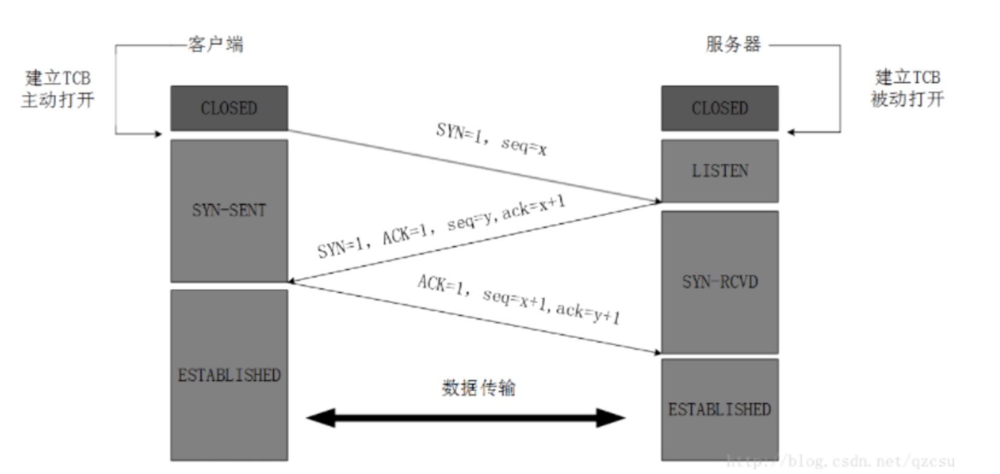
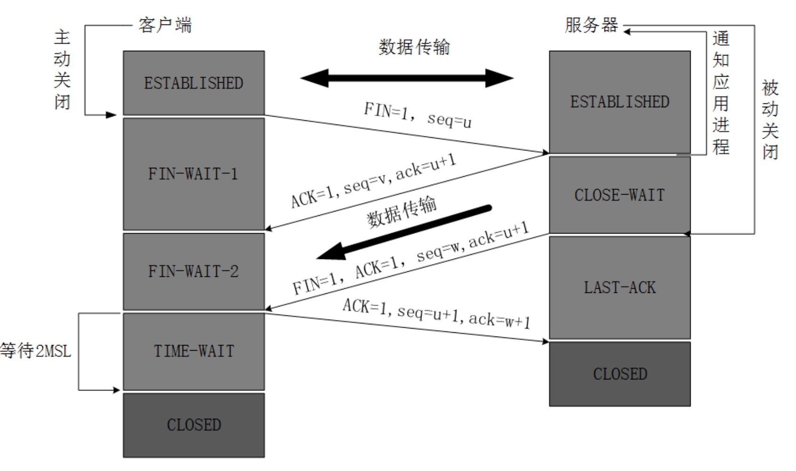
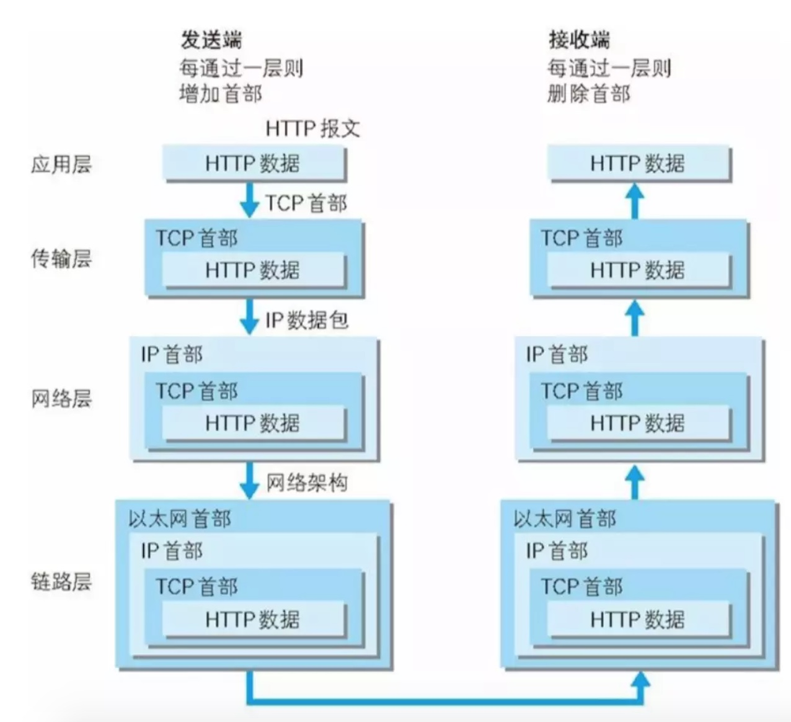
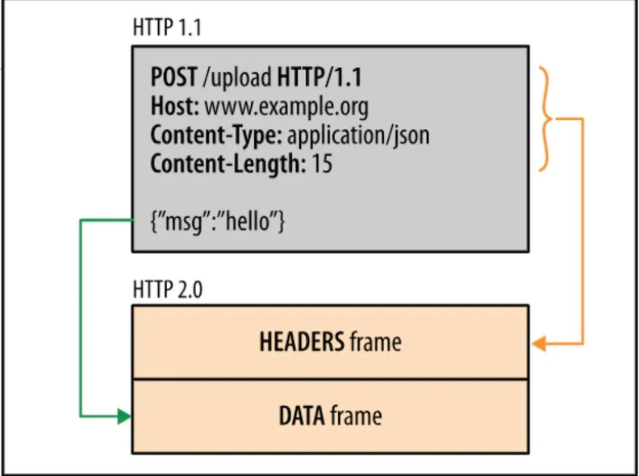

### 状态码

1. 消息
2. 成功
3. 重定向
4. 请求错误
5. 服务器错误

### 请求方式

1. GET: 请求指定的页面信息，并返回实体主体。
2. POST: 向指定资源提交数据进行处理请求。POST 请求可能会导致新的资源的建立和/或已有资源的修改。
3. PUT：从客户端向服务器传送的数据取代指定的文档的内容。
4. PATCH: 是对 PUT 方法的补充，用来对已知资源进行局部更新 。
5. DELETE: 请求服务器删除指定的页面。
6. OPTIONS: 允许客户端查看服务器的性能。获取服务器支持的请求方式。
7. HEAD: 类似于 GET 请求，只不过返回的响应中没有具体的内容，用于获取报头。

### HTTP部首

用首部字段(General Header Fields):请求报文和响应报文两方都会使用的首部

* Cache-Control 控制缓存
* Connection 连接管理、逐条首部
* Upgrade 升级为其他协议
* via 代理服务器的相关信息
* Wraning 错误和警告通知
* Transfor-Encoding 报文主体的传输编码格式
* Trailer 报文末端的首部一览
* Pragma 报文指令
* Date 创建报文的日期

请求首部字段(Reauest Header Fields):客户端向服务器发送请求的报文时使用的首部

* Accept 客户端或者代理能够处理的媒体类型
* Accept-Encoding 优先可处理的编码格式
* Accept-Language 优先可处理的自然语言
* Accept-Charset 优先可以处理的字符集
* If-Match 比较实体标记(ETage)
* If-None-Match 比较实体标记（ETage）与 If-Match相反
* If-Modified-Since 比较资源更新时间（Last-Modified）
* If-Unmodified-Since比较资源更新时间（Last-Modified），与 If-Modified-Since相反
* If-Rnages 资源未更新时发送实体byte的范围请求
* Range 实体的字节范围请求
* Authorization web的认证信息
* Proxy-Authorization 代理服务器要求web认证信息
* Host 请求资源所在服务器
* From 用户的邮箱地址
* User-Agent 客户端程序信息
* Max-Forwrads 最大的逐跳次数
* TE 传输编码的优先级
* Referer 请求原始放的url
* Expect 期待服务器的特定行为

响应首部字段(Response Header Fields):从服务器向客户端响应时使用的字段

* Accept-Ranges 能接受的字节范围
* Age 推算资源创建经过时间
* Location 令客户端重定向的URI
* vary 代理服务器的缓存信息
* ETag 能够表示资源唯一资源的字符串
* WWW-Authenticate 服务器要求客户端的验证信息
* Proxy-Authenticate 代理服务器要求客户端的验证信息
* Server 服务器的信息
* Retry-After 和状态码503 一起使用的首部字段，表示下次请求服务器的时间

实体首部字段(Entiy Header Fields):针对请求报文和响应报文的实体部分使用首部

* Allow 资源可支持http请求的方法
* Content-Language 实体的资源语言
* Content-Encoding 实体的编码格式
* Content-Length 实体的大小（字节）
* Content-Type 实体媒体类型
* Content-MD5 实体报文的摘要
* Content-Location 代替资源的yri
* Content-Rnages 实体主体的位置返回
* Last-Modified 资源最后的修改资源
* Expires 实体主体的过期资源

### 三次握手四次挥手

三次握手

* 客户端–发送带有SYN标志的数据包–一次握手–服务端
* 服务端–发送带有SYN/ACK标志的数据包–二次握手–客户端
* 客户端–发送带有带有ACK标志的数据包–三次握手–服务端

1. TCP服务器进程先创建传输控制块TCB，时刻准备接受客户进程的连接请求，此时服务器就进入了LISTEN（监听）状态；
2. TCP客户进程也是先创建传输控制块TCB，然后向服务器发出连接请求报文，这是报文首部中的同部位SYN=1，同时选择一个初始序列号 seq=x ，此时，TCP客户端进程进入了 SYN-SENT（同步已发送状态）状态。TCP规定，SYN报文段（SYN=1的报文段）不能携带数据，但需要消耗掉一个序号。
3. TCP服务器收到请求报文后，如果同意连接，则发出确认报文。确认报文中应该 ACK=1，SYN=1，确认号是ack=x+1，同时也要为自己初始化一个序列号 seq=y，此时，TCP服务器进程进入了SYN-RCVD（同步收到）状态。这个报文也不能携带数据，但是同样要消耗一个序号。
4. TCP客户进程收到确认后，还要向服务器给出确认。确认报文的ACK=1，ack=y+1，自己的序列号seq=x+1，此时，TCP连接建立，客户端进入ESTABLISHED（已建立连接）状态。TCP规定，ACK报文段可以携带数据，但是如果不携带数据则不消耗序号。
5. 当服务器收到客户端的确认后也进入ESTABLISHED状态，此后双方就可以开始通信了。

四次挥手

* 客户端-发送一个FIN，用来关闭客户端到服务器的数据传送
* 服务器-收到这个FIN，它发回一个ACK，确认序号为收到的序号加1 。和SYN一样，一个FIN将占用一个序号
* 服务器-关闭与客户端的连接，发送一个FIN给客户端
* 客户端-发回ACK报文确认，并将确认序号设置为收到序号加1

1. 客户端进程发出连接释放报文，并且停止发送数据。释放数据报文首部，FIN=1，其序列号为seq=u（等于前面已经传送过来的数据的最后一个字节的序号加1），此时，客户端进入FIN-WAIT-1（终止等待1）状态。 TCP规定，FIN报文段即使不携带数据，也要消耗一个序号。
2. 服务器收到连接释放报文，发出确认报文，ACK=1，ack=u+1，并且带上自己的序列号seq=v，此时，服务端就进入了CLOSE-WAIT（关闭等待）状态。TCP服务器通知高层的应用进程，客户端向服务器的方向就释放了，这时候处于半关闭状态，即客户端已经没有数据要发送了，但是服务器若发送数据，客户端依然要接受。这个状态还要持续一段时间，也就是整个CLOSE-WAIT状态持续的时间。
3. 客户端收到服务器的确认请求后，此时，客户端就进入FIN-WAIT-2（终止等待2）状态，等待服务器发送连接释放报文（在这之前还需要接受服务器发送的最后的数据）。
4. 服务器将最后的数据发送完毕后，就向客户端发送连接释放报文，FIN=1，ack=u+1，由于在半关闭状态，服务器很可能又发送了一些数据，假定此时的序列号为seq=w，此时，服务器就进入了LAST-ACK（最后确认）状态，等待客户端的确认。
5. 客户端收到服务器的连接释放报文后，必须发出确认，ACK=1，ack=w+1，而自己的序列号是seq=u+1，此时，客户端就进入了TIME-WAIT（时间等待）状态。注意此时TCP连接还没有释放，必须经过2∗\*∗MSL（最长报文段寿命）的时间后，当客户端撤销相应的TCB后，才进入CLOSED状态。
6. 服务器只要收到了客户端发出的确认，立即进入CLOSED状态。同样，撤销TCB后，就结束了这次的TCP连接。可以看到，服务器结束TCP连接的时间要比客户端早一些。

### 为什么客户端最后还要等待2MSL？

MSL（Maximum Segment Lifetime），TCP允许不同的实现可以设置不同的MSL值。

第一，保证客户端发送的最后一个ACK报文能够到达服务器，因为这个ACK报文可能丢失，站在服务器的角度看来，我已经发送了FIN+ACK报文请求断开了，客户端还没有给我回应，应该是我发送的请求断开报文它没有收到，于是服务器又会重新发送一次，而客户端就能在这个2MSL时间段内收到这个重传的报文，接着给出回应报文，并且会重启2MSL计时器。

第二，防止类似与“三次握手”中提到了的“已经失效的连接请求报文段”出现在本连接中。客户端发送完最后一个确认报文后，在这个2MSL时间中，就可以使本连接持续的时间内所产生的所有报文段都从网络中消失。这样新的连接中不会出现旧连接的请求报文。

### 为什么建立连接是三次握手，关闭连接确是四次挥手呢？

建立连接的时候， 服务器在LISTEN状态下，收到建立连接请求的SYN报文后，把ACK和SYN放在一个报文里发送给客户端。

而关闭连接时，服务器收到对方的FIN报文时，仅仅表示对方不再发送数据了但是还能接收数据，而自己也未必全部数据都发送给对方了，所以己方可以立即关闭，也可以发送一些数据给对方后，再发送FIN报文给对方来表示同意现在关闭连接，因此，己方ACK和FIN一般都会分开发送，从而导致多了一次。

### 如果已经建立了连接，但是客户端突然出现故障了怎么办？

TCP还设有一个保活计时器，显然，客户端如果出现故障，服务器不能一直等下去，白白浪费资源。服务器每收到一次客户端的请求后都会重新复位这个计时器，时间通常是设置为2小时，若两小时还没有收到客户端的任何数据，服务器就会发送一个探测报文段，以后每隔75秒发送一次。若一连发送10个探测报文仍然没反应，服务器就认为客户端出了故障，接着就关闭连接。

发送端在层与层间传输数据时，没经过一层都会被加上首部信息，接收端每经过一层都会删除一条首部

### HTTP请求响应分为三个部分，起始行、消息头和消息体

HTTP请求的起始行称为请求行，形如GET /index.html HTTP/1.1

HTTP响应的起始行称为状态行，形如200 ok

消息头部有很多键值对组成，多个键值对之间使用CRLF作为分隔符，也可以完全没有键值对。形如Content-Encoding: gzip

### 分块传输

当浏览器向服务器请求一个资源时，这个资源是一个动态资源，服务器无法提前预知资源的大小，这个时候就可以使用分块传输。

服务器先生成一个thunk，发送这个chunk，再生成一个chunk，再发送一个chunk，直到全部资源传送完成。

分块传送需要在请求头增加一个特殊的键值对transfer-encoding: chunked，那么消息体的内容便是分块传送的。

### Keep-Alive

Http1.1默认开启keep-alive，如果加入connection: close，才关闭。keep alive来解决复用TCP的问题，但是还是无法解决请求阻塞问题。

所谓请求阻塞意思就是一条TCP的connection在同一时间只能允许一个请求经过，这样假如后续请求想要复用这个链接就必须等到前一个完成才行。

HTTP协议中keep-alive与TCP中keep-alive的区别：

1. HTTP协议(七层)的Keep-Alive意图在于连接复用，希望可以短时间内在同一个连接上进行多次请求/响应。举个例子，你搞了一个好项目，想让马云爸爸投资，马爸爸说，"我很忙，最多给你3分钟”，你需要在这三分钟内把所有的事情都说完。核心在于：时间要短，速度要快。
2. TCP协议(四层)的KeepAlive机制意图在于保活、心跳，检测连接错误。当一个TCP连接两端长时间没有数据传输时(通常默认配置是2小时)，发送keepalive探针，探测链接是否存活。例如，我和厮大聊天，开了语音，之后我们各自做自己的事，一边聊天，有一段时间双方都没有讲话，然后一方开口说话，首先问一句，"老哥，你还在吗？”，巴拉巴拉..。又过了一会，再问，"老哥，你还在吗？”。核心在于：虽然频率低，但是持久。

### HTTP2.0

HTTP发展到1.1存在有哪些问题:

1. 线头阻塞：TCP连接上只能发送一个请求，前面的请求未完成前，后续的请求都在排队等待。
2. 多个TCP连接
 虽然HTTP/1.1管线化可以支持请求并发，但是浏览器很难实现，chrome、firefox等都禁用了管线化。所以1.1版本请求并发依赖于多个TCP连接，建立TCP连接成本很高，还会存在慢启动的问题。
3. 头部冗余，采用文本格式
 HTTP/1.X版本是采用文本格式，首部未压缩，而且每一个请求都会带上cookie、user-agent等完全相同的首部。
4. 客户端需要主动请求

HTTP2.0的改进

概念:

* 流（Stream）：已建立的TCP连接上的双向字节流，可以承载一个或多个消息。
 * 消息（Message）：一个完整的HTTP请求或响应，由一个或多个帧组成。特定消息的帧在同一个流上发送，这意味着一个HTTP请求或响应只能在一个流上发送。
 * 帧（Frame）：通信的基本单位。一个TCP连接上可以有任意数量的流。

1\. 二进制分帧层

HTTP2性能提升的核心就在于二进制分帧层。HTTP2是二进制协议，他采用二进制格式传输数据而不是1.x的文本格式。

1.1响应是文本格式，而2.0把响应划分成了两个帧，图中的HEADERS（首部）和DATA（消息负载） 是帧的类型，一条HTTP响应，划分成了两个帧来传输，并且采用二进制来编码。

2\. 多路复用

上面提到HTTP/1.1的线头阻塞和多个TCP连接的问题，HTTP2的多路复用完美解决。HTTP2让所有的通信都在一个TCP连接上完成，真正实现了请求的并发。HTTP2建立一个TCP连接，一个连接上面可以有任意多个流（stream），消息分割成一个或多个帧在流里面传输。帧传输过去以后，再进行重组，形成一个完整的请求或响应。这使得所有的请求或响应都无法阻塞。

3\. 头部压缩

头部压缩需要在浏览器和服务器端之间

维护一份相同的静态字典，包含常见的头部名称，以及常见的头部名称和值的组合

维护一份相同的动态字典，可以动态的添加内容

通过静态Huffman编码对传输的首部字段进行编码

4\. 服务器端推送:

服务器端推送使得服务器可以预测客户端需要的资源，主动推送到客户端。

例如：客户端请求index.html，服务器端能够额外推送script.js和style.css。

实现原理就是客户端发出页面请求时，服务器端能够分析这个页面所依赖的其他资源，主动推送到客户端的缓存，当客户端收到原始网页的请求时，它需要的资源已经位于缓存。针对每一个希望发送的资源，服务器会发送一个PUSH\_PROMISE帧，客户端可以通过发送RST\_STREAM帧来拒绝推送（当资源已经位于缓存）。这一步的操作先于父响应（index.html），客户端了解到服务器端打算推送哪些资源，就不会再为这些资源创建重复请求。当客户端收到index.html的响应时，script.js和style.css已经位于缓存。

### GET和POST有一个区别

GET产生一个TCP数据包；POST产生两个TCP数据包。

对于GET方式的请求，浏览器会把http header和data一并发送出去，服务器响应200（返回数据）。

而对于POST，浏览器先发送header，服务器响应100 continue，浏览器再发送data，服务器响应200 ok（返回数据）。

### HTTP安全

XSS

XSS 全称 Cross Site Scripting 即跨站点脚本攻击, 本来 Cross Site Scripting

XSS 简单的来说就是在那些本身善良，受信任的目标网站上注入恶意代码，通过这些恶意代码，攻击者可以实施盗取用户数据，盗取用户的 session 等等危害行为。那攻击者是怎么注入恶意代码的呢? 一个应用或多或少需要接收用户输入的数据，同时如果你的应用在输出用户数据时没有对它们进行验证或者编码或者采取的相关措施不够仔细严格，那么就会给攻击者以可乘之机，攻击者会在很多让你意想不到的地方向你的应用注入恶意代码。

1. 不插入任何不信任的数据
2. HTML转义
3. Javascript转义
4. Cookie http-only
5. CSP: 在响应头 Content-Security-Policy 里添加一些 CSP 相关的指令就可以实现 CSP

### **CSRF**

CSRF 全称 Cross-Site Request Forgery, 意思是跨站点请求伪造。CSRF 的攻击原理比较好理解，比如我在站点 A 登录过了，然后我用同一个浏览器去访问站点 B 的某个页面， 很不幸，此页面上被某些攻击者添加了一些恶意代码或者链接，如果我在 A 上的会话(session)没有过期，那么这些恶意代码或者链接就可能以我的名义绕过认证去作一些恶意的操作等。

1. 不使用Get方法请求一些有副作用的操作
2. CSRF Token验证

### Session Fixation 固定会话攻击

1. 做好XSS
2. reset\_session
3. 判断登陆ip

****

### **浏览器输入url按回车背后经历了哪些**

1. **

  首先，在浏览器地址栏中输入url，先解析url，检测url地址是否合法

**
2. 浏览器先查看浏览器缓存-系统缓存-路由器缓存，如果缓存中有，会直接在屏幕中显示页面内容。若没有，则跳到第三步操作。浏览器缓存：浏览器会记录DNS一段时间，因此，只是第一个地方解析DNS请求；操作系统缓存：如果在浏览器缓存中不包含这个记录，则会使系统调用操作系统，获取操作系统的记录(保存最近的DNS查询缓存)；路由器缓存：如果上述两个步骤均不能成功获取DNS记录，继续搜索路由器缓存；ISP缓存：若上述均失败，继续向ISP搜索。
3. 在发送http请求前，需要域名解析(DNS解析)，解析获取相应的IP地址。
4. 浏览器向服务器发起tcp连接，与浏览器建立tcp三次握手。
5. 握手成功后，浏览器向服务器发送http请求，请求数据包。
6. 服务器处理收到的请求，将数据返回至浏览器
7. 浏览器收到HTTP响应
8. 浏览器解码响应，如果响应可以缓存，则存入缓存。
9. 浏览器发送请求获取嵌入在HTML中的资源（html，css，javascript，图片，音乐······），对于未知类型，会弹出对话框。
10. 浏览器发送异步请求。
11. 页面全部渲染结束。

### HTTP 和 HTTPS

1. HTTP 是明文传输，HTTPS 通过 SSL\\TLS 进行了加密
2. HTTP 的端口号是 80，HTTPS 是 443
3. HTTPS 需要到 CA 申请证书，一般免费证书很少，需要交费
4. HTTPS 的连接很简单，是无状态的；HTTPS 协议是由 SSL+HTTP 协议构建的可进行加密传输、身份认证的网络协议，比 HTTP 协议安全。

SSL 是洋文“Secure Sockets Layer”的缩写，中文叫做“安全套接层”。

TLS（是“Transport Layer Security”的缩写），中文叫做“传输层安全协议”。