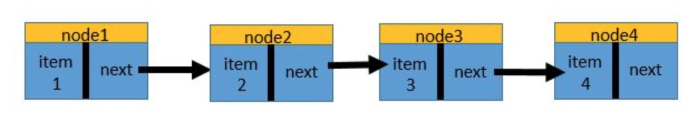

链表
--

链表其实跟数组差不多，都是一群元素的集合。链表中的各个元素，我们称之为节点。一个节点也没有的链表，就是一个空链表。在非空的链表里，每个节点又分为两部分：第一部分是这个节点的容器，用来储存信息；另一部分是该节点指针，指向其他节点，以便我们将单个单个的节点串联起来。链表的示意图如下：


```ruby
class Node
  attr_accessor :item, :next
  def initialize(item)
    @item = item                      # 用来保存信息
    @next = nil                       # 用来指向下一个节点
  end
end

node1 = Node.new(1)
node2 = Node.new(2)
node4 = Node.new(4)
node1.next = node2
node2.next = node4
# 插入node3
node3 = Node.new(3)
node2.next = node3
node3.next = node4
# 删除node3
node2.next = node4

# 反转链表
class LinkedListNode
  attr_accessor :value, :next_node

  def initialize(value, next_node=nil)
    @value = value
    @next_node = next_node
  end
end

node1 = LinkedListNode.new(1)
node2 = LinkedListNode.new(2, node1)
node3 = LinkedListNode.new(3, node2)
# 循环
# 1-2-3 = > [1-nil, 2-1-nil, 3-2-1-nil]
def reverse_list(list)
  return nil if list.nil?
  
  current = list
  node = nil
  
  while current != nil
    next_node = current.next_node
    current.next_node = node
    node = current
    current = next_node
  end
  node
end

# 递归
def reverse_list(list, previous=nil)
  binding.pry
  current = list.next_node
  list.next_node = previous
  if current
    reverse_list(current, list)
  else
    list
  end
end
```

队列
--

队列访问节点的顺序和排队一样。在按顺序遍历访问队列的时候，先进入队列的节点会先被访问到；后进入队列的节点将后被访问到。因此，队列也被称为先进先出（FIFO）队列

我们至少需要维护队列的第一个节点，才能访问队列中所有的节点。在向队列中添加新节点的时候，我们默认将新节点添加到队列的末尾。因为我们需要返回队列的长度，所以我们还可以设置一个变量@length来维护队列的长度



```ruby
class Queue
  attr_reader :first, :length 
  def initialize # 初始化一个队列
    @first = nil
    @last = nil
    @length = 0
  end
 
  def enqueue(item) # 向队列的末尾添加一个元素
    node = Node.new(item)
    if is_empty?
      @first = node
      @last = @first
    else
      @last.next = node
      @last = @last.next
    end
    @length += 1
  end
 
  def dequeue # 删除队列的第一个元素
    return nil if @first == nil
    item = @first.item
    @first = @first.next
    @length -= 1
    @last = nil if is_empty?
    return item
  end
 
  def is_empty? # 返回队列是否为空（即队列中是否没有节点）
    return @length == 0
  end
end
```

栈
-

队列是按照节点进入队列的先后顺序依次访问，而栈刚好相反：先进入栈的节点后被访问，后进入栈的节点先被访问，最后进入栈的节点第一个被访问。也就是后进先出。

我们加入节点的顺序是node4, node3, node2, node1.而访问节点的时候，我们则按照从上到下的顺序：node1, node2, node3, node4.

```ruby
class Node
  attr_accessor :item, :next
  def initialize(item)
    @item = item                     
    @next = nil
    @min = nil
  end
end

class Stack
  attr_reader :first, :length
  def initialize # 初始化一个栈
    @first = nil
    @length = 0
  end
 
  def push(item) # 向栈顶压入一个节点
    @min = item if @first.nil?
    @min = item if @min > item
    old_first = @first        # 备份原来的栈顶节点
    @first = Node.new(item)   # 新建一个节点，并将它标记为新的栈顶节点
    @first.next = old_first   # 将新的栈顶节点的next指针指向原来的栈顶节点。
    @length += 1
  end
 
  def pop # 将栈顶的节点弹出
    return nil if is_empty?   # 栈本身为空的情况下直接返回空
    item = @first.item        # 保存原先栈顶节点的item
    @first = @first.next      # 将原栈的第二个节点标记为栈顶节点
    @length -= 1
    item
  end
 
  def is_empty? # 返回栈是否为空
    @length == 0
  end
end

stack = Stack.new
stack.push(1)

def reverse_stack(stack)
  
  
end
```

有序数组
----

```ruby
class BinarySearchST
  attr_reader :length, :keysc
  def initialize # 初始化一个有序数组
    @keys = []
    @nodes = []
    @length = 0
  end
 
  def insert(key, node)  # 向有序数组中插入一个节点
    i = _rank(key)                    # 确定待插入的新节点的位置
    if i < @length && @keys[i] == key # 如果@keys中存在新节点的key
      @nodes[i] = node                # 直接将对应位置的节点替换
    else                              # 否则将新节点位置的节点及后面的节点向后移动一位，为新节点腾出空位置
      j = @length
      while j > i
        @keys[j] = @keys[j - 1]
        @nodes[j] = @nodes[j - 1]
      end
      @keys[i] = key                  # 腾出空位置以后再插入新的节点
      @nodes[i] = node
      @length += 1
    end
  end
 
  def delete(key) # 删除有序数组中的某个节点
    i = _rank(key)
    return if @keys[i] != key
    for j in i..@keys.length - 1
      @keys[j] = @keys[j + 1]
      @nodes[j] = @nodes[j + 1]
    end
    @keys[j + 1] = nil
    @nodes[j + 1] = nil
    @length -= 1
  end
 
  def search(key) # 返回有序数组中的某个节点
    return nil if is_empty?  # 如果有序数组为空，直接返回空值
    i = _rank(key)         # 确定key在@keys中的位置
    if @keys[i] == key       # 如果@keys[i]的值和key相同则说明查找命中
      return @nodes[i]       # 就返回其对应的节点
    else
      return nil             # 如果keys[i]的值和key不同，就返回空（查找未命中）
    end
  end
 
  def contains?(key) # 返回有序数组中是否包含某个节点
    search(key) != nil
  end
 
  def length # 返回有序数组的长度
    @length
  end
 
  def is_empty? # 返回有序数组是否为空
    @length == 0
  end
 
  def min # 返回key值最小的节点
    @nodes[0]
  end
 
  def max # 返回key值最大的节点
    @nodes[-1]
  end
 
  def keys # 返回所有节点的keys值组成的数组
    @keys
  end
  
  def _rank(key)                             # 通过二分查找寻找key在@keys中的位置
    index = 0
    size = @keys.length - 1
    while index <= size
      mid = index + (size - index) / 2
      if @keys[mid] > key
        size = mid - 1
      elsif @keys[mid] < key
        index = mid + 1
      else
        mid
      end
    end
    return index
  end
end
```